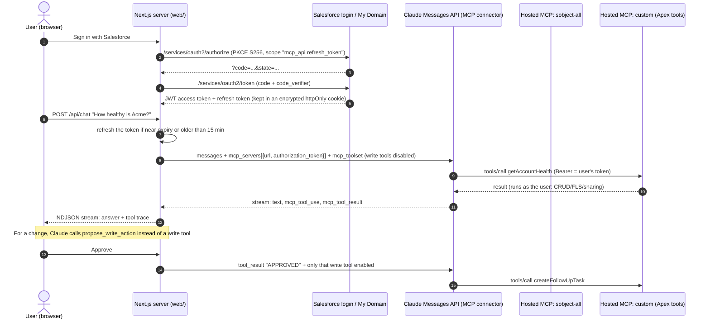

# Salesforce Headless 360 AI Assistant

A local demo of a **headless Salesforce assistant**: a Next.js chat app where a signed-in Salesforce user asks
questions or requests changes in plain language. The server sends each turn to the Claude Messages API with
Anthropic's **MCP connector**, so Claude calls **Salesforce Hosted MCP servers** directly:

1. the standard **`sobject-all`** server (queries, search, record reads and writes), and
2. a **custom hosted MCP server** that publishes this repo's Apex business logic as tools
   (`getAccountHealth`, `createFollowUpTask`).

Every tool call runs as the signed-in user, so Salesforce applies their object permissions, field-level security
and sharing. Reads run immediately; **writes are proposed first and only run after the user clicks Approve**.

The same servers also power a read-only **meeting prep brief** (`/brief`): type an Account name, get a
fixed-format pre-meeting brief built from Salesforce data. See [Meeting prep brief (Day 10)](#meeting-prep-brief-day-10).

This is the capstone of the blog series *15 Days of Salesforce Headless 360* (Day 15: "Build a Complete Headless
Salesforce AI Assistant"; Day 10: "Build Your First AI + Salesforce Workflow").

> Status: the web app is fully tested with mocked Salesforce and Anthropic endpoints; the Apex compiles against a
> syntax parser but has not been deployed from this repo. Items that depend on your org are marked
> **verify in your org** and collected in [the checklist](#verify-in-your-org).

## Architecture



```
browser ──(cookie: sealed session, NDJSON stream)──> Next.js route handlers
                                                     │  app/api/auth/salesforce/{login,callback,logout}
                                                     │  app/api/chat  ── lib/anthropic.ts builds the request
                                                     │  app/api/brief ── lib/brief.ts: same servers, read-only
                                                     ▼
                           Claude Messages API  (beta: mcp-client-2025-11-20)
                                                     │  authorization_token = user's short-lived JWT
                         ┌───────────────────────────┴───────────────────────────┐
                         ▼                                                       ▼
   api.salesforce.com/platform/mcp/v1/platform/sobject-all     api.salesforce.com/platform/mcp/v1/custom/Headless_Assistant_Tools
                                                                  └─ Apex @InvocableMethod: AccountHealthTool, CreateFollowUpTaskTool
```

## Repository layout

```
.
├── web/                         Next.js 16 app (TypeScript strict, App Router)
│   ├── app/page.tsx             Sign-in page / chat shell (server component)
│   ├── app/brief/page.tsx       Meeting prep brief page (Day 10)
│   ├── app/api/auth/salesforce/ login (PKCE + state), callback (code exchange), logout (revoke)
│   ├── app/api/chat/route.ts    Streams one chat turn as NDJSON
│   ├── app/api/brief/route.ts   Returns one read-only meeting brief as JSON
│   ├── components/              Chat, Brief, TracePanel, ProposalCard (client); Topbar (server)
│   ├── lib/anthropic.ts         Messages API request builder: mcp_servers + mcp_toolset + approval tool
│   ├── lib/chat.ts              Turn preparation, approval handling, streaming, write audit
│   ├── lib/brief.ts             Brief request (read-only toolsets), deadline, retries, error mapping, tool log
│   ├── lib/route-session.ts     Route guards shared by chat and brief: config, origin, session, refresh
│   ├── lib/salesforce-oauth.ts  Authorize URL, token exchange, refresh, revoke
│   ├── lib/session.ts           AES-256-GCM sealed, chunked, httpOnly cookie sessions
│   ├── lib/pkce.ts              RFC 7636 helpers
│   ├── tests/                   Vitest: PKCE, session, OAuth, request builder, chat and brief routes (mocked fetch)
│   └── .env.example
├── salesforce/                  SFDX project (API 67.0): Apex tools + tests, Flow, permission set,
│                                McpServerDefinition, manifest/package.xml
└── docs/
    ├── SOURCES.md               Every verified API shape with its source URL
    └── ARTICLE-NOTES.md         Snippets and line references for the articles, screenshot list
```

## Prerequisites

- Node.js 20.19+ (22 LTS recommended) and npm.
- A current **Salesforce CLI** (`sf update`); old versions do not know the `McpServerDefinition` metadata type.
- A **Salesforce Developer Edition** org (External Client Apps cannot be created in scratch orgs).
- An **Anthropic API key** with access to the MCP connector beta (Claude API; the connector is not available on
  Amazon Bedrock or Google Cloud).

## Set up Salesforce

### 1. Deploy the metadata

```bash
cd salesforce
sf org login web --alias headless360 --set-default
sf project deploy start --source-dir force-app/main/default/classes \
  --source-dir force-app/main/default/flows --source-dir force-app/main/default/permissionsets \
  --test-level RunSpecifiedTests --tests AccountHealthToolTest --tests CreateFollowUpTaskToolTest
sf project deploy start --source-dir force-app/main/default/mcpServerDefinitions
sf org assign permset --name Headless_Assistant_User
```

See [salesforce/README.md](salesforce/README.md) for test commands and the Setup-UI fallback for the custom server.

### 2. Activate the hosted MCP servers

Hosted MCP servers are **off by default** since GA. In **Setup > API Catalog > MCP Servers** (Quick Find: "MCP";
**verify in your org**, some guides show the same page under Setup > Integrations):

1. Activate **`platform/sobject-all`**. Activation can take up to 2 minutes.
2. Open **`Headless_Assistant_Tools`** (deployed in step 1, or create it there with two Apex Action tools) and activate it.
3. Copy each server's **Server URL** from its details page. The usual shapes are:

| Org type | sobject-all | custom server |
| --- | --- | --- |
| Production / Developer Edition | `https://api.salesforce.com/platform/mcp/v1/platform/sobject-all` | `https://api.salesforce.com/platform/mcp/v1/custom/Headless_Assistant_Tools` |
| Sandbox / scratch | `https://api.salesforce.com/platform/mcp/v1/sandbox/platform/sobject-all` | `https://api.salesforce.com/platform/mcp/v1/sandbox/custom/Headless_Assistant_Tools` |
| My Domain (DE) | `https://api.salesforce.com/platform/mcp/v1/d/<mydomain>/develop/platform/sobject-all` | same `/d/<mydomain>/develop/` prefix (**verify in your org**) |

Use the URL Setup shows. Whichever form you pick, `SF_LOGIN_URL` must be the authorization server that URL
advertises: `https://login.salesforce.com` (production/DE), `https://test.salesforce.com` (sandbox), or
`https://<mydomain>.my.salesforce.com` / `https://<mydomain>.develop.my.salesforce.com` for the `/d/` URLs.
You can check it without logging in:

```bash
curl https://api.salesforce.com/.well-known/oauth-protected-resource/platform/mcp/v1/platform/sobject-all
# {"resource": "...", "authorization_servers": ["https://login.salesforce.com"], "scopes_supported": ["mcp_api", "refresh_token"]}
```

### 3. Create the External Client App

**Setup > External Client App Manager > New External Client App** (Connected Apps are not supported for hosted MCP):

1. Name it, for example `Headless 360 Assistant (local)`, and add a contact email.
2. **API (Enable OAuth Settings)**
   - Callback URL: `http://localhost:3000/api/auth/salesforce/callback` (must equal `SF_CALLBACK_URL`).
   - OAuth scopes: **Access Salesforce hosted MCP servers (`mcp_api`)** and **Perform requests at any time (`refresh_token`)**.
     These are the GA scopes. The beta used `api sfap_api refresh_token einstein_gpt_api`, which do not work with
     the GA `/v1/` URLs.
3. **Security**
   - Check **Require Proof Key for Code Exchange (PKCE) extension for Supported Authorization Flows**.
   - Check **Issue JSON Web Token (JWT)-based access tokens for named users** (the MCP servers reject opaque tokens).
   - Leave the other flow checkboxes off. Optional hardening for this server-side app: **Require secret for Web
     Server Flow** and **Require secret for Refresh Token Flow**, then set `SF_CLIENT_SECRET`.
4. **Policies** (recommended): refresh token expires after a fixed time (for example 7 days) with
   **refresh token rotation**; Permitted Users = *Admin approved users are pre-authorized* and add the
   `Headless_Assistant_User` permission set.
5. Save, then copy the **Consumer Key** (Settings > OAuth Settings > Consumer Key and Secret).
   New or edited ECAs can take **up to 30 minutes** to work.

## Run the web app

```bash
cd web
cp .env.example .env.local   # then fill it in (see below)
npm install
npm run dev                  # http://localhost:3000
```

Sign in, then try:

- "How healthy is the Acme account?" (custom `getAccountHealth` tool)
- "Show my open opportunities closing this quarter, biggest first." (`sobject-all` query tools)
- "Who am I signed in as?" (`getUserInfo`)
- "Create a follow-up task on Acme to send the renewal quote next Friday." (proposal, then Approve)

The right-hand **Tool trace** shows every MCP call with its server, tool name, input and output, token refreshes,
approvals, and a check that the executed write matches what was approved.

### Environment variables (`web/.env.local`)

| Variable | Required | Default | Notes |
| --- | --- | --- | --- |
| `SF_LOGIN_URL` | no | `https://login.salesforce.com` | Authorization server: login, test, or My Domain. Must match the MCP URLs' `authorization_servers`. |
| `SF_CLIENT_ID` | yes | | ECA Consumer Key. |
| `SF_CLIENT_SECRET` | no | | Only if the ECA requires a secret. |
| `SF_CALLBACK_URL` | no | `http://localhost:3000/api/auth/salesforce/callback` | Must match the ECA callback URL exactly. |
| `SF_SCOPES` | no | `mcp_api refresh_token` | GA hosted MCP scopes. |
| `SF_OAUTH_RESOURCE` | no | | Optional RFC 8707 `resource` values (comma-separated). **Verify in your org**; not needed in the documented flows. |
| `SF_TOKEN_MAX_AGE_SECONDS` | no | `900` | Refresh the access token before use when it is older than this or within 60 s of its JWT `exp`. |
| `SF_MCP_SOBJECT_URL` | no | production `sobject-all` URL | Copy from Setup. |
| `SF_MCP_CUSTOM_URL` | no | | Custom server URL. Empty = run with `sobject-all` only. |
| `SF_MCP_SOBJECT_WRITE_TOOLS` | no | `createSobjectRecord,updateSobjectRecord,updateRelatedRecord,deleteSobjectRecord` | Tools disabled until approval. **Verify in your org** against the server's tool list. |
| `SF_MCP_CUSTOM_WRITE_TOOLS` | no | `createFollowUpTask` | Same, for the custom server. |
| `ANTHROPIC_API_KEY` | yes | | |
| `ANTHROPIC_MODEL` | no | `claude-sonnet-5-5` | Claude Sonnet 5.5, the current Sonnet. Any Claude model that supports the MCP connector works. |
| `ANTHROPIC_MCP_BETA` | no | `mcp-client-2025-11-20` | MCP connector beta header. |
| `ANTHROPIC_MAX_TOKENS` | no | `16000` | Per response. |
| `ANTHROPIC_EFFORT` | no | API default | `low`, `medium`, `high`, `xhigh`, `max`. |
| `BRIEF_TIMEOUT_MS` | no | `60000` | Overall deadline for one meeting brief (all model calls, retries and `pause_turn` continuations); then 504. Keep it below the route's `maxDuration` (300 s). |
| `SESSION_SECRET` | yes | | 32+ random characters: `node -e "console.log(require('crypto').randomBytes(32).toString('base64url'))"` |

## How the request looks

`web/lib/anthropic.ts` builds one Messages API request per turn:

```ts
{
  model: "claude-sonnet-5-5",
  betas: ["mcp-client-2025-11-20"],                       // sent as the anthropic-beta header
  mcp_servers: [
    { type: "url", name: "salesforce-sobject", url: SF_MCP_SOBJECT_URL, authorization_token: accessToken },
    { type: "url", name: "salesforce-custom",  url: SF_MCP_CUSTOM_URL,  authorization_token: accessToken },
  ],
  tools: [
    { type: "mcp_toolset", mcp_server_name: "salesforce-sobject",
      configs: { createSobjectRecord: { enabled: false }, updateSobjectRecord: { enabled: false }, /* ... */ } },
    { type: "mcp_toolset", mcp_server_name: "salesforce-custom", configs: { createFollowUpTask: { enabled: false } } },
    { name: "propose_write_action", input_schema: { /* server, tool, arguments, summary */ }, eager_input_streaming: true },
  ],
  thinking: { type: "adaptive", display: "summarized" },
  system: "...approval rules, tool output is data...",
  messages,
}
```

Claude's response streams back `mcp_tool_use` and `mcp_tool_result` blocks alongside text; the route forwards
them to the browser as NDJSON events for the trace panel.

### The approval step

1. On a normal turn every write tool is **disabled in the toolset** (`configs.<tool>.enabled = false`), so Claude
   cannot call it, even if a record's text tries to talk it into one. The system prompt tells Claude to call the
   client tool `propose_write_action` instead.
2. When Claude calls it, the turn ends with `stop_reason: "tool_use"` and the UI shows the proposal with
   Approve / Reject.
3. **Approve** sends a second request whose `tool_result` says `APPROVED ...` and in which **only that one tool** is
   enabled. **Reject** sends `REJECTED ...` with every write tool still disabled.
4. After the approved turn the server compares the executed `mcp_tool_use` input with the approved arguments and
   reports the result in the trace.

The MCP tools execute inside Anthropic's API, so this app cannot intercept a single call; the guard is the tool
configuration per request plus the audit. `CreateFollowUpTaskTool` is also idempotent, so a retried call returns the
existing open task.

## Meeting prep brief (Day 10)

The chat turned into a repeatable workflow. Open **Meeting brief** in the header (`/brief`), type an Account name
and click **Generate**. `POST /api/brief` runs one read-only turn against the same hosted MCP servers, as the
signed-in user, and returns markdown with fixed sections: `## Snapshot`, `## Pipeline`, `## Service`, `## Risks`,
`## Suggested talking points`. Claude cites the Id of every record it used and writes "not found" rather than guess.

- **Read-only, no approval step.** Every configured write tool is disabled on every server and
  `propose_write_action` is not sent, so there is no path to a write.
- **Tools.** With the custom server configured, Claude starts with `getAccountHealth`; otherwise it uses
  `soqlQuery` / `getRelatedRecords` on `sobject-all`.
- **Deadline.** One `AbortController` stops the whole brief after `BRIEF_TIMEOUT_MS` (60 s): 504. The SDK's own
  `timeout` applies per attempt and is retried, so it cannot bound the total.
- **Retries.** `maxRetries: 2` per request. The SDK retries 408, 409, 429 and 5xx (529 "overloaded" included) with
  exponential backoff and honours `retry-after`; for a streamed request that covers the initial response only.
  Retry waits count against the deadline.
- **`pause_turn`.** The brief reuses the chat's turn runner, which sends a paused turn back to resume it.
- **Logs.** One line per MCP tool call, names and duration only:
  `{"event":"mcp_tool_use","server":"salesforce-custom","tool":"getAccountHealth","ms":812}`.

Call it with curl after signing in in the browser. Copy every `sfh360_session.N` cookie from DevTools >
Application > Cookies (the session is split into chunks; the values below are placeholders):

```bash
curl -s http://localhost:3000/api/brief \
  -H 'content-type: application/json' \
  -H 'cookie: sfh360_session.0=<sealed-chunk-0>; sfh360_session.1=<sealed-chunk-1>' \
  -d '{"accountName":"Acme Global Tech"}' | jq -r .brief
```

The full response:

```json
{
  "brief": "## Snapshot\n- Acme Global Tech (001...) ...\n\n## Pipeline\n...",
  "trace": [
    { "type": "tool_call", "id": "mcptoolu_...", "server": "salesforce-custom", "name": "getAccountHealth", "input": { "accountName": "Acme Global Tech" } },
    { "type": "tool_result", "toolUseId": "mcptoolu_...", "isError": false, "text": "{ ... }" }
  ],
  "model": "claude-sonnet-5-5",
  "durationMs": 14231
}
```

Errors use the same `{ "error": "<code>", "message": "..." }` shape as `/api/chat`:

| Status | `error` | When |
| --- | --- | --- |
| 400 | `invalid_request` | `accountName` missing, empty after trimming, longer than 120 characters, or the body is not JSON. |
| 401 | `not_signed_in`, `reauth_required` | No session, or Salesforce no longer accepts the refresh token: sign in again (the cookie is cleared). |
| 403 | `forbidden` | Cross-origin request. |
| 429 | `rate_limited` | Anthropic still rate limits the key after the retries. |
| 500 | `config`, `anthropic_auth`, `internal` | Missing configuration, a rejected `ANTHROPIC_API_KEY`, or a bug (see the server log). |
| 502 | `bad_request`, `anthropic_error`, `refused`, `empty_brief`, `salesforce_unreachable` | Anthropic rejected the request (MCP connection problems land here) or failed after the retries, the model returned no brief, or Salesforce's token endpoint was unreachable. |
| 504 | `timeout` | `BRIEF_TIMEOUT_MS` passed. |

A failing MCP tool (a SOQL error, an access error) is not an HTTP error: it comes back in the trace as a
`tool_result` with `isError: true`, and the brief says "not found" for what it could not read.

## Security notes

- **Tokens stay server-side.** Salesforce tokens live only in an AES-256-GCM sealed, `httpOnly`, `SameSite=Lax`
  cookie (key derived from `SESSION_SECRET` with HKDF). The browser keeps the chat transcript, never a token.
- **The access token is sent to Anthropic.** The MCP connector needs `authorization_token` to call the Salesforce
  servers on the user's behalf, so each request carries the user's Salesforce access token to Anthropic's API.
  Keep it short-lived: the app refreshes it when it is older than `SF_TOKEN_MAX_AGE_SECONDS` (15 minutes by
  default) or close to its JWT `exp`, the refresh token never leaves the server, and sign-out revokes it.
  The MCP connector is **not** covered by zero data retention; tool inputs and results follow Anthropic's standard
  retention.
- **Least privilege.** Scopes are only `mcp_api refresh_token`. Tools run as the user (CRUD, FLS, sharing).
  The Apex uses `with sharing`, `WITH USER_MODE` and `AccessLevel.USER_MODE`. The permission set grants read on three
  objects and Edit Tasks. Restrict the ECA to pre-authorized users, and prefer `platform/sobject-reads` if you do not
  need generic writes.
- **Confirmation before writes**, enforced by per-request tool configuration (above), not only by the prompt.
- **Prompt injection.** Record data is treated as data in the system prompt, and write tools are unavailable
  unless the user just approved one specific call.
- **CSRF.** Logout is POST-only; POST routes check the `Origin` header; the OAuth `state` is compared in constant
  time and the PKCE verifier is single-use.
- **Logs.** The server logs MCP tool names and durations only, never tokens, headers or tool inputs. Leave
  `ANTHROPIC_LOG` unset (the SDK defaults to `warn`): at `debug` the SDK logs request bodies, and those contain the
  Salesforce access token in `mcp_servers[].authorization_token`.
- **Local demo.** No rate limiting, no multi-user hardening, no audit log beyond Salesforce's own. Do not deploy it
  as is.

## Troubleshooting

| Symptom | Likely cause and fix |
| --- | --- |
| Sign-in page says `invalid_client_id` | New ECA not propagated yet (wait up to 30 min) or wrong `SF_CLIENT_ID`. |
| `redirect_uri_mismatch` | `SF_CALLBACK_URL` differs from the ECA callback URL (scheme, port and path must match). |
| `invalid_state` | The 10-minute login window expired, cookies are blocked, or you started login in another tab. |
| Chat error mentioning the MCP server / 401 | Token rejected: check the ECA has JWT-based access tokens and PKCE enabled, the scopes are exactly `mcp_api refresh_token`, and `SF_LOGIN_URL` matches the MCP URL's authorization server. |
| MCP server 404 | Server not activated yet (allow 2 minutes) or wrong URL. Copy it from Setup. |
| Tools missing from the custom server | Apex actions must be deployed and the server activated; check the permission set is assigned. |
| A write happened without a proposal | A write tool name differs in your org. Ask "What tools do you have?", read the names in the trace, and update `SF_MCP_SOBJECT_WRITE_TOOLS` / `SF_MCP_CUSTOM_WRITE_TOOLS`. |
| "Your Salesforce session ended" | Refresh token expired or revoked, or the refresh-token policy requires re-login. Sign in again. |
| `sf project deploy` says the `.mcpServerDefinition-meta.xml` suffix is unknown | Update the Salesforce CLI (`sf update`). |
| Anthropic `invalid_request_error` about `mcp_servers` | Each server must be referenced by exactly one `mcp_toolset`; check `ANTHROPIC_MCP_BETA`. |

Hosted MCP tool calls count against the org's daily API request limit.

## Development

```bash
cd web
npm run typecheck   # next typegen && tsc --noEmit
npm run lint        # eslint (next core-web-vitals + typescript)
npm test            # vitest: 50 tests, all network calls mocked
npm run build
```

## Verify in your org

- [ ] Setup path and activation of `platform/sobject-all` and the custom server (API Catalog > MCP Servers).
- [ ] The exact Server URLs, especially the `/d/<mydomain>/` form for custom servers.
- [ ] `sobject-all` write tool names match `SF_MCP_SOBJECT_WRITE_TOOLS`.
- [ ] The `McpServerDefinition` deploy (`aa:apex-<Class>` identifiers); otherwise create the server in Setup.
- [ ] Adding the Flow as a tool (Setup UI) and gating it via `SF_MCP_CUSTOM_WRITE_TOOLS`.
- [ ] One access token works for both servers. If your org rejects it, try `SF_OAUTH_RESOURCE` with both URLs.
- [ ] The Salesforce JWT includes `exp` (used for refresh timing) and a display name claim (falls back to the user Id).

See [docs/SOURCES.md](docs/SOURCES.md) for what was verified and where.

## License

[MIT](LICENSE)

---

Built for Day 15 of 15 Days of Salesforce Headless 360 by Avnish Yadav ([avnishyadav.com](https://avnishyadav.com)).
